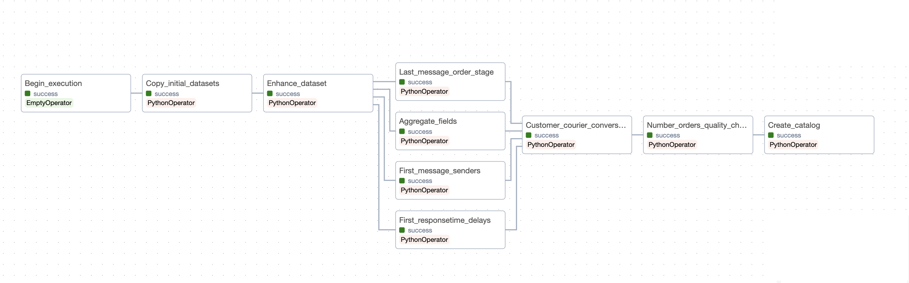

<!--
Open the README.md file from my git repository in order to view it 
in its rendered version.
https://github.com/Angelos1/conversations_glovo/blob/main/README.md
-->
## Assumptions

1) Our pipeline is running monthly on data on the input folder. So I assume that the "input" directory is 
used by other business processes to write the **orders.json** and the **customer_courier_chat_messages.json**
in it once a moth. These business processes monitor our pipeline from the Aiflow UI and know if it run successfully on the data 
they imported in the "input" folder, so they know when to add the next monthly batch.
2) I assume that the dataset is very big. That is what I used ***pyspark***. 
To take advantage of reading and processing the datasets as well as writing the results using Spark parallel processing 
capabilities and parquet files thus having a significant improvement in performance.


The program runs in a docker container which has an Aiflow and a pyspark installation. 
The Airflow server and the Spark programs both run in this container.
In a realistic scenario we would have airflow running in a server, Spark running in a cluster
and all spark jobs would run in the Spark cluster so that we take advantage of the parallel execution of Spark. 
In order to achieve that we would instantiate the ```SparkSession``` in **conversations_etl.py** file 
in the Spark cluster by changing the ```.master('local')```   with ```.master(<spark_cluster_master_connection_URL>)```.
If in the future the input datasets become significantly bigger then we can easily
scale horizontally by adding another Spark worker in the Spark cluster.
Ideally I would implement the whole solution on Amazon s3 and EMR(adding and removing workers from the cluster come out of the box).
 

## Structure of the airflow/conversations_etl.py file
The airflow/conversations_etl.py file is the file where the tasks of the pipeline are
defined. Airflow reads this file and creates the pipeline that you see in the Airflow UI.
SO, this file represents the whole Airflow DAG.

I could have used better code standards (e.g. create Python modules and import
them in this file) but you can see that I just created a big Python file while I could have
broken down the program into more files.
The reason behind this is that the airflow installation in the docker container
could not recognise any modules defined out of the DAG python file (airflow/conversations_etl.py).
I troubleshoot it, but I did not find the issue. Therefore, I decided to develop one big python file
so that I present an airflow dockerized solution. I can explain further when we discuss together.

To make the code more readable for the assessor, I segmented the code in the airflow/conversations_etl.py file.
I put the code required for each of the defined Airflow tasks in blocks of code bordered as below:
```
# -----------------------
# Code block for task
.
.
.
# -----------------------
```
For example the code for the first Airflow task is in the following block: 

```
# -----------------------------------------------------------------------------------------------------------------------
# Code block for initial_datasets_to_datalake_operator

def initial_datasets_to_datalake():
    """
    The callable function of the initial_datasets_to_datalake_operator.

    Copies the initial datasets (chat-messages and orders datasets) inside the initial_datasets directory
    in the data lake

    """

    # Get a list of all files in the source directory
    files_to_copy = os.listdir(input_dir)

    # Create initial_datasets_dir in the datalake
    if not os.path.exists(initial_datasets_dir):
        os.makedirs(initial_datasets_dir)

    # Copy each file from the source to the destination
    for file_name in files_to_copy:
        source_file_path = os.path.join(input_dir, file_name)
        destination_file_path = os.path.join(initial_datasets_dir, file_name)
        shutil.copy(source_file_path, destination_file_path)
        logging.info('Copied {} to {}'.format(file_name, destination_file_path))

    logging.info('All files copied successfully.')


input_datasets_to_datalake_operator = PythonOperator(
    task_id='Copy_initial_datasets',
    python_callable=initial_datasets_to_datalake,
    dag=dag
)
# -----------------------------------------------------------------------------------------------------------------------
```
So, each Airflow task is defined these code blocks and at the end
of the file we define the task dependencies:
```
# tasks that will run in parallel
tasks_to_be_executed_in_parallel = [first_message_senders_operator,
                                    first_responsetime_delays_operator,
                                    last_message_order_stage_operator,
                                    aggregate_fields_operator]

# setting the DAG dependencies
start_operator >> input_datasets_to_datalake_operator >> enhance_dataset_operator
enhance_dataset_operator >> tasks_to_be_executed_in_parallel >> customer_courier_conversations_operator
customer_courier_conversations_operator >> num_orders_quality_check_operator >> create_catalog_operator
```
This defines the structure of the graph of tasks (Airflow DAG) 
that I will show you next.


## Building and running the pipeline

1) Ensure ***Docker*** is running on your PC and ***port 8080*** is free
Open a terminal inside project directory ***conversations_glovo*** and run the command:\
```$ docker compose up```
2) Wait for the docker application to start (until the terminal stops producing logs or 2-3 minutes)and then
open you Google Chrome browser and go to the website ```localhost:8080``` which is the Airflow UI url.
3) On the sign in form that comes up sign in with the credentials: \
Username: glovo \
Password: glovo
4) You can see a table containing all the defined pipelines in our Airflow instance:\

Activate the conversations_pipeline by clicking on the red circled toggle button (see image above) and then click on the 
blue circled play button (see image above) to start running the pipeline.
5) Wait until the pipeline has successfully run:\

The image above shows how the UI will be after the pipeline has successfully run (see blue circled parts)
6) Now that the pipeline has successfully run you can find the created data lake in the **data_lake** 
directory of the project.

## Orchestration of the pipeline
After the pipeline has run successfully click on the **'conversations_pipeline'** clickable text 
(circled with red in the image above). Then click on the **'Graph'** button at the top of the page to see
the DAG (directed acyclic graph) of the pipeline tasks, you will see what's in the below image. 
This is how we can monitor the progress of our pipeline.



* Scheduling:
The pipeline is scheduled to run monthly.

* Specifying the tasks:
You can see that each task has a name. This task name is defined by the **task_id** parameter of the tasks
respective PythonOperator. You can see the specification of each task in the description of its callable
function in **_airflow/conversations_etl.py_** file.

* Dependencies:
From this graph you can also see the dependencies between the pipeline tasks.

* Handling failures:
We can configure Airflow to send us an email in case of task failure.
Then we can go to the Airflow UI and see the logs of the failed task fix any code or input dataset mistakes
and rerun the task manually (If a task fails we can rerun it from the UI by clicking on it and rerunning it).
If we rerun a task at the same day that the ETL pipeline was run then everything will run well. 
But if we run the task on a subsequent day there will be an error. That is because the output directory for the data
pipeline is set to have as name the date when the pipeline has run. When we rerun a task the subsequent, the task
looks for a directory that has the current date as name which it doesn't exist. 
That is why an exception will be thrown.
This happens because of the way I set this directory name with the code ```date_today = date.today()```
in the **_airflow/conversations_etl.py_**. **date_today** is instantiated everytime a task is run and it
is the name of the datalake directory discussed.
A future improvement will be to have aan initial airflow task to write this directory name in a file 
and have all the other tasks reading the directory name from the file.

  


## Explaining the program

When the pipeline runs successfully we have the following directory structure created in the datalake:


A directory named with the date that the pipeline has run is created and inside it has all the datasets for 
the pipeline:
* The **'initial_datasets'** contains the initial json files that where received in the input folder.
* The **'customer_courier_conversations'** contains the final dataset of the pipeline in _parquet_ files partitioned by city_code
* The **'customer_courier_conversations.csv'** contains the final dataset in a csv format so tha
the assessor can view it in tabular format.
* The rest contain datasets that are created by the intermediate steps of the pipeline and eventually are joined
to create the final **'customer_courier_conversations'** final data set. 
The **'customer_courier_chat_messages_enhanced'** contains the data from the initial chat messages json file
with 3 added columns (year, month and timestamp columns derived from the 'messageSentTime' column) in _parquet_ files partitioned
by the year and month of the messageSentTime. This dataset is created at the beginning of the pipeline and the following
intermediate steps read this dataset and process it.

Notes: 
* I created a small input dataset (with the generating_datasets/generating_datasets.py) to run the program 
(around 2000-3000 records) so that I run it quickly but the program is written to handle a big dataset.
* I created the _**'customer_courier_chat_messages_enhanced'**_ as parquet files partitioned by year and month. 
I used _parquet_ files in order to take advantage of their columnar storage for better performance on fetching column data. 
Also we gain storage efficiency as compressed columnar files take less space.
* I partitioned by year, month since I know that the data are uniformly distributed by year and month
(from the way I generated the dataset, Each date of conversation is created randomly). 
Thus partitioning by year and month we have equal partitions. 
I did this partitioning in case that some end users (e.g. data analysts or scientists) want to retrieve some of this
data by year or month. That way they don't need to retrieve the whole dataset.
If this was a real dataset I would do some exploration of data in the beginning to find which fields 
might be closer to uniform distribution and partition by them.

I broken down the calculation of the final conversations dataset into small intermediate tests
for 3 main reasons:
1) To parallelize most of the calculation with many small queries running in parallel 
rather than one big query (see **_tasks_to_be_executed_in_parallel_** 
variable _conversations_etl.py_ file)
2) To improve the data linage of the dataset by knowing how the data was 
calculated, from which source and what code was run.
That way debugging errors in the resulting dataset easier becomes much easier.

more data quality check need to be added in order for the program to be fully 


Structure
no time for unit tests. But if taking into account the structure of my tests the only unit tests 
I could write are tests for the callable functions of the operators using one of pythons testing libraries
For each of the operators that read from a dataset, processes and writes to another dataset I would need 
to create the relevant datasets to read from and the expected resulting dataset and compare the resulting dataset with 
the expected resulting dataset.

For the **num_orders_quality_check_operator** I would need to prepare two test cases.
For the first test I would need to create one dataset for customer-courier chat messages and one for
the resulting customer-courier conversations that their unique orderId counts don't match and expect to throw and exception.
The second test case I would need to create datasets of the same specification as the ones in the first test case
for which their unique orderIds counts match and expect the check to pass.

For the **create_catalog_operator** I would create a small directory structure as input and see if the resulting 
data_lake_catalog.json describes the directory structure as expected.


\
\
\
\
\
\
\
\
\
\
