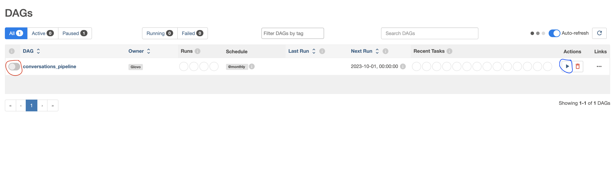
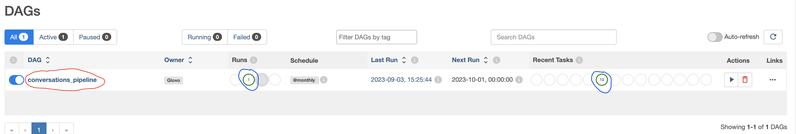
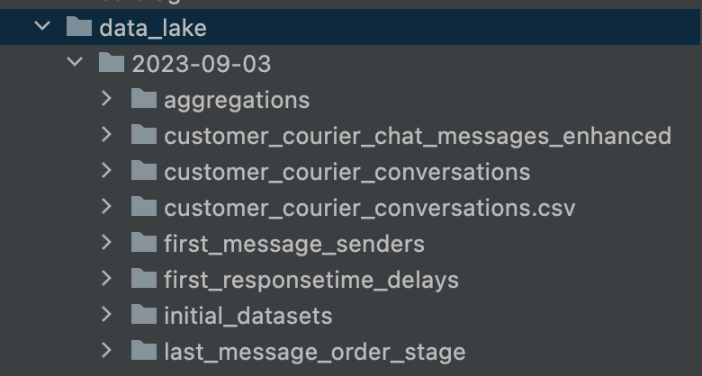

<!--
Open the README.md file from my git repository in order to view it 
in its rendered version.
https://github.com/Angelos1/conversations_glovo/blob/main/README.md
-->
## Assumptions

1) Our pipeline is running monthly on data on the input folder. So I assume that the "input" directory is 
used by other business processes to write the **orders.json** and the **customer_courier_chat_messages.json**
in it once a moth. These bussiness processes monitor our pipeline from the Aiflow UI and know if it run successfully on the data 
they imported in the "input" folder so they know when to add the next monthly batch.
2) I assume that the dataset is really big. That is what I used ***pyspark***. 
To take advantage of reading and processing the datasets as well as writing the results using Spark parrallelization
capabilities and parquet files thus having a significant improvement in performance.


The program runs in a docker container which has an Aiflow and a pyspark installation. 
The Airflow server and the Spark programs both run in this container.
In a realistic scenario we would have airflow running in a server and Spark running in a cluster
and all spark jobs would run in the Spark cluster so that we take advantage of the parallel execution of Spark. 
In order to achieve that we would instantiate the ```SparkSession``` in **conversations_etl.py** file 
in the Spark cluster by changing the ```.master('local')```   with ```.master(<spark_cluster_master_connection_URL>)```.
 

## Building and running the pipeline

1) Ensure ***Docker*** is running on your PC and ***port 8080*** is free
Open a terminal inside project directory ***conversations_glovo*** and run the command:\
```$ docker compose up```
2) Wait for the docker application to start (until the terminal stops producing logs or 2-3 minutes)and then
open you Google Chrome browser and go to the website ```localhost:8080``` which is the Airflow UI url.
3) On the sign in form that comes up sign in with the credentials: \
Username: glovo \
Password: glovo
4) You can see a table containing all the defined pipelines in our Airflow instance:

Activate the conversations_pipeline by clicking on the red circled toggle button (see image above) and then click on the 
blue circled play button (see image above) to start running the pipeline.
5) Wait until the pipeline has successfully run:
The image above shows how the UI will be after the pipeline has successfully run (see blue circled parts)
6) Now that the pipeline has successfully run you can find the created data lake in the **data_lake** 
directory of the project.

## Explaining the program

When the pipeline runs successfully we have the following directory structure created in the datalake:


A directory named with the date that the pipeline has run is created and inside it has all the datasets for 
the pipeline:
* The **'initial_datasets'** contains the initial json files that where received in the input folder.
* The **'customer_courier_conversations'** contains the final dataset of the pipeline in _parquet_ files partitioned by city_code
* The **'customer_courier_conversations.csv'** contains the final dataset in a csv format so tha
the assessor can view it in tabular format.
* The rest contain datasets that are created by the intermediate steps of the pipeline and eventually are joined
to create the final **'customer_courier_conversations'** final data set. 
The **'customer_courier_chat_messages_enhanced'** contains the data from the initial chat messages json file
with 3 added columns (year, month and timestamp columns derived from the 'messageSentTime' column) in _parquet_ files partitioned
by the year and month of the messageSentTime. This dataset is created at the beginning of the pipeline and the following
intermediate steps read this dataset and process it.

Notes: 
* I created a small input dataset (with the generating_datasets/generating_datasets.py) to run the program 
(around 2000-3000 records) so that I run it quickly but the program is written to handle a big dataset.
* I created the _**'customer_courier_chat_messages_enhanced'**_ as parquet files partitioned by year and month. 
I used _parquet_ files in order to take advantage of their columnar storage for better performance on fetching column data. 
Also we gain storage efficiency as compressed columnar files take less space.
* I partitioned by year, month since I know that the data are uniformly distributed by year and month
(from the way I generated the dataset, Each date of conversation is created randomly). 
Thus partitioning by year and month we have equal partitions. 
I did this partitioning in case that some end users (e.g. data analysts or scientists) want to retrieve some of this
data by year or month. That way they don't need to retrieve the whole dataset.
If this was a real dataset I would do some exploration of data in the beginning to find which fields 
might be closer to uniform distribution and partition by them.


## Structure of the airflow/conversations_etl.py file
The airflow/conversations_etl.py file is the file where the tasks of the pipeline are
defined. Airflow reads this file and creates the pipeline that you see in the Airflow UI.
SO, this file represents the whole Airflow DAG.

I could have used better code standards (e.g. create Python modules and import
them in this file) but you can see that I just created a big Python file while I could have
broken down the program into more files.
The reason behind this is that the airflow installation in the docker container
could not recognise any modules defined outside of the DAG python file (airflow/conversations_etl.py).
I troubleshoot it extensively but I didn’t find the issue. Therefore I decided to develop one big python file
so that I present an airflow dockerized solution. I can explain further when we discuss together.

To make the code more readable for the assessor, I segmented the it in the airflow/conversations_etl.py file.
I put the code required for each of the defined Airflow tasks in blocks of code bordered as below:
```
# -----------------------
# Code block for task
.
.
.
# -----------------------
```
For example the code for the first Airflow task is in the following block: 

```
# -----------------------------------------------------------------------------------------------------------------------
# Code block for initial_datasets_to_datalake_operator

def initial_datasets_to_datalake():
    """
    The callable function of the initial_datasets_to_datalake_operator.

    Copies the initial datasets (chat-messages and orders datasets) inside the initial_datasets directory
    in the data lake

    """

    # Get a list of all files in the source directory
    files_to_copy = os.listdir(input_dir)

    # Create initial_datasets_dir in the datalake
    if not os.path.exists(initial_datasets_dir):
        os.makedirs(initial_datasets_dir)

    # Copy each file from the source to the destination
    for file_name in files_to_copy:
        source_file_path = os.path.join(input_dir, file_name)
        destination_file_path = os.path.join(initial_datasets_dir, file_name)
        shutil.copy(source_file_path, destination_file_path)
        logging.info('Copied {} to {}'.format(file_name, destination_file_path))

    logging.info('All files copied successfully.')


input_datasets_to_datalake_operator = PythonOperator(
    task_id='Copy_initial_datasets',
    python_callable=initial_datasets_to_datalake,
    dag=dag
)
# -----------------------------------------------------------------------------------------------------------------------
```
So, each Airflow task is defined these code blocks and at the end
of the file we define the task dependencies:
```
# tasks that will run in parallel
tasks_to_be_executed_in_parallel = [first_message_senders_operator,
                                    first_responsetime_delays_operator,
                                    last_message_order_stage_operator,
                                    aggregate_fields_operator]

# setting the DAG dependencies
start_operator >> input_datasets_to_datalake_operator >> enhance_dataset_operator
enhance_dataset_operator >> tasks_to_be_executed_in_parallel >> customer_courier_conversations_operator
customer_courier_conversations_operator >> num_orders_quality_check_operator >> create_catalog_operator
```
This defines the structure of the graph of tasks (Airflow DAG) 
that I will show you next.


more data quality check need to be added in order for the program to be fully 


no time for unit tests. But if taking into account the structure of my tests the only unit tests 
I could write are tests for the callable functions of the operators using one of pythons testing libraries
For each of the operators that read from a dataset, processes and writes to another dataset I would need 
to create the relevant datasets to read from and the expected resulting dataset and compare the resulting dataset with 
the expected resulting dataset.

For the **num_orders_quality_check_operator** I would need to prepare two test cases.
For the first test I would need to create one dataset for customer-courier chat messages and one for
the resulting customer-courier conversations that their unique orderId counts don't match and expect to throw and exception.
The second test case I would need to create datasets of the same specification as the ones in the first test case
for which their unique orderIds counts match and expect the check to pass.

For the **create_catalog_operator** I would create a small directory structure as input and see if the resulting 
data_lake_catalog.json describes the directory structure as expected.


\
\
\
\
\
\
\
\
\
\
***create_tables.py***\
Creates the Sparkify database and the tables.
First it drops the database if it already exists and then creates it, then creates the tables.

***etl.py***\
Runs the ETL from the song files and log files to the songplays, artists, songs, users and time tables.
Reads the song files and log files into python dataframes, processes their data to extract the
requred information and then inserts the data into the tables.

***sql_queries.py***\
Contains all the sql statements that create_tables.py and etl.py need to run.\
DROP and CREATE statements for create_tables.py\
INSERT and SELECT staments for etl.py\
COPY statements for bulk insertion for time and users tables.

## Schema design
Describing the main schema design considerations through the lines of the 
CREATE TABLE statements from the sql_queries.py file.

**Table songplays**

- *songplay_id bigserial as PRIMARY KEY*\
Used the bigserial data type so that we have a unique incremental identifier for each record. 
In addition I used bigserial and not just serial because I am expecting a lot of activity 
for users thus a lot of records.

- *start_time timestamp NOT NULL REFERENCES time(start_time)*\
NOT NULL because the start time is expected to always be recorded by the system (otherwise there's a possible bug).
We also have a foreign key to time.start_time because this is the join attribute for both tables and start_time is the primary key of time table.

- *user_id int NOT NULL REFERENCES users(user_id)*\
NOT NULL because the primal goal for the Sparkify database is to analyze user activity so we need every songplay record to have information for user.
We also have a foreign key to users.user_id because this is the join attribute for both tables and user_id is the primary key of users table.

- *song_id varchar REFERENCES songs(song_id)*\
We have a foreign key to songs.song_id because this is the join attribute for both tables and song_id is the primary key of songs table.

- *artist_id varchar REFERENCES artists(artist_id)*\
We have a foreign key to artists.artist_id because this is the join attribute for both tables and artist_id is the primary key of artists table.

- *UNIQUE(start_time, user_id, level, song_id, artist_id, session_id, location, user_agent) constraint*\
We have the above unique constraint because the combination of the above attibuttes uniquely identifies a user activity. This constraint protects us from the case where the log files contain duplicate data.

**Table users**

- *user_id int PRIMARY KEY*\
every user is uniquely identified by the user_id

- *gender char(1)*\
Genders are 'M' or 'F' so no I chose char(1) for it's data type to save memory space.
No need to use varchar for this field.

- *level varchar*:\
I chose varchar as the data type for level because I am not sure if there is another level
other than 'free' or 'paid'.
If I was confident that the level values are only 'free' and 'paid' I would choose char(4).

**Table songs**

- *song_id varchar PRIMARY KEY*\
every song is uniquely identified by the song_id.

**Table artists**

- *artist_id varchar PRIMARY KEY*\
every artist is uniquely identified by the artist_id.

- *latitude double precision*\
*longitude double precision*\
I chose double precision data type for both latitude and longitude because they have a lot of
decimal points.

**Table time**

- *start_time varchar PRIMARY KEY*\
every time instance is uniquely identified by the start_time which is a timestamp.


## ETL justification
We are directly loading data from the song files and log files fields so the ETL is pretty straightforward. 
For all the tables the ETL is straightforward except for songplays which has an extra step.
I believe that what explains the ETL pipeline completely are the ideas behind the ON COFLICT part of the insert statements. 
That is the way I will try to explain it.

**Table users**

- *ON CONFLICT (user_id) DO\
    UPDATE SET level = EXCLUDED.level*\
We are loading user data from the log files. The log files contain user activities therefore a user_id might appear many times in the dataset and it may have different levels each time. Assuming that the etl.py file reads the data files records in a chronologicall order, we use the above ON CONFLICT statement to update the user's level to the most recent one evevry time there is a conflict.   

**Table songs**

- *ON CONFLICT (song_id) DO NOTHING*\
We use this in case there are duplicated data in the song files.

**Table artists**

- *ON CONFLICT (artist_id) DO NOTHING*\
There are artists that have more than one song and therefore if artist_id is present in more than one song files we do not load them the second time they appear on our ETL.

**Table time**

- *ON CONFLICT (start_time) DO NOTHING*\
Even though it is almost impossible, two users might perform an activity at the same time, or one user
might click a button that triggers two actions (e.g GET songs and GET artists). 
In this case there will be two records in the log file  with the same timestamp.
Therefore we use ON CONFLICT DO NOTHING so that do not load the same timestamp twice.

**Table songplays**

- *ON CONFLICT (start_time, user_id, level, song_id, artist_id, session_id, location, user_agent) DO NOTHING*\
In case that there were duplicate data in the data files we do not load them the second time they appear on our ETL.

- Now for the songplays ETL data we have an extra step because we need to populate it with data from
both song files and log files. The way we perform this is that for each record in the log files
we use the fields song_name, artist_name and duration of the song and with these we query the artists
and songs tables (see song_select query in sql_queries.py) in order to get artist_it and song_id. Then we write the full songplay record in the database.


## Implementation with COPY command for Bulk insertion (incomplete)

I made an attempt to implement this but it is incomplete and not tested because I had no time.
The implementation is in etlCOPYcommand.py file which is like the etl.py file but it has some changes on the implementation of the process_log_file function.
What is done differently that I save the time and user dataframes into csv files and then I use this csv files to perform the COPY statements.
I didnt't have time to test this extensively but for some reason the COPY statement of the time table runs but does not insert any records (while running the same statement in test.ipynb runs successfully).
In addition the COPY statement does not have ON CONFICT handling so currently my implementation will violate primary key constraints because it will try to insert duplicate data (e.g. insert records with the same user_id in the users table).
If I had time I would try to handle this by using the COPY command to insert the data from the csv files to a temporary table (e.g. users_tmp_table and time_tmp_table) and then use the following commands to insert from the temporary tables to the final tables (as discused in this [post](https://stackoverflow.com/questions/48019381/how-postgresql-copy-to-stdin-with-csv-do-on-conflic-do-update)):\
\
***INSERT INTO users\
SELECT \*\
FROM users_tmp_table\
ON CONFLICT (user_id) DO\
    UPDATE SET level = EXCLUDED.level;***
    
The same way I would handle the time table:

***INSERT INTO time\
SELECT \*\
FROM time_tmp_table\
ON CONFLICT (start_time) DO NOTHING\
;***
    
